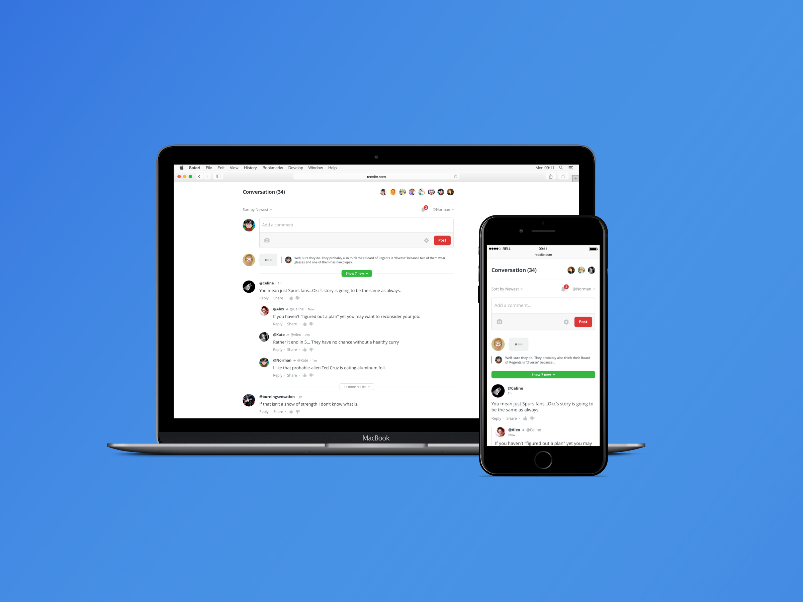

# Spot.IM Integration
This repository contains instructions for integrating Spot.IM onto your site, including customizing widgets to match your brand.
For more information contact Spot.IM at https://www.spot.im/contact/ 

**Getting Started:**
* [Before you begin](social-kit/README.md#before-you-begin) - Understanding your personal Spot ID and Post IDs before getting started. 

**Features:**
* [Social Kit](social-kit/README.md) - Conversation and Popular in the Community widgets
* [Conversation](conversation/README.md) - Real-Time Conversation is a lightweight, customizable module to inspire audience engagement.
    * [Importing Conversations](social-kit/README.md#Integrations) - Import [Facebook](social-kit/README.md#facebook), Wordpress, [Disqus Posts](social-kit/README.md#disqus), and/or [Livefyre Posts](conversation/import-posts/livefyre-import/README.md)
    * Display [comments count](conversation/comments-count/README.md) anywhere on your page
    * [Back-to-comments](conversation/back-to-comments/README.md)
    * [Multiple Conversation Instances](conversation/multiple-conversation-instances/README.md)
    * Community Question - Engage your community with a custom question or call to action displayed above the conversation.
* [Popular in the Community](recirculation/README.md) - Popular in the Community, or Community Recirculation, promotes your page's content by showcasing user-generated content.
* [Community Spotlight](spotlight/README.md) - Community Spotlight showcases your community.
* [Community Pages](community/README.md) - Community Pages
    * [Community Promo](community/community-promo/README.md)

**Network Options:**
* [Open API](api/open-api/README.md)
* [Single Sign On (SSO)](api/single-sign-on/README.md)

**More:**
* Integrating Spot.IM in [Google AMP](google-amp/README.md)
* [Improve SEO](seo/README.md) with Spot.IM
* [WordPress Integration](wordpress/README.md)
    * [AMP for WordPress](wordpress/ampforwp/README.md)
    * [Live-Blog on WordPress](wordpress/live-blog/README.md)
* Registering listeners for [client-side events](api/js-events/README.md)

<!-- UPDATE BANNER!!! -->
