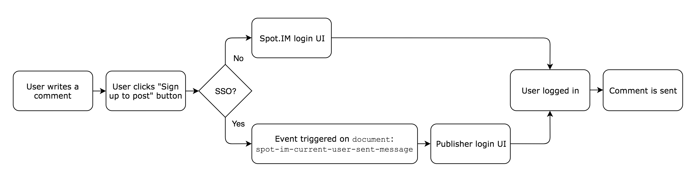

# SSO (Single Sign On) with Spot.IM


Single Sign On (SSO) enables the partner user to auto-login to Spot.IM when he's logged into the Partner's site.
To accomplish this, the partner needs to let Spot.IM know which user is currently logged into his site, in a secure manner.
Understanding the technical flow is the sole challenge of performing a successful SSO implementation.

The following diagram demonstrates the generic flow:


1. Spot.IM lets the Partner know that it has been loaded and is now ready

2. Partner asks Spot.IM to start an SSO session

3. Spot.IM gives the SSO session a unique identifier called codeA

4. Partner passes the codeA to his backend

5. Partner passes the codeA to Spot.IM backend, alongside the user details

6. Spot.IM logs the user in (registers it too if needed)

7. Spot.IM acknowledges the success by providing the success codeB

8. Partner passes the success codeB to his Front End

9. Partner passes the success codeB to Spot.IM FED

10. Spot.IM FED logs in the user and displays his avatar as logged in

## Frontend Login integration
This code sample corresponds to the steps given above:
```javascript
if (window.SPOTIM && window.SPOTIM.startSSO) {
  startSSO();
} else {
  document.addEventListener('spot-im-api-ready', startSSO, false);
}
function startSSO(){
  var callback = function(codeA, completeSSOCallback) {
        // call your backend to receive codeB and return it
        // to Spot.IM via completeSSOCallback function
        $.ajax({
            method: 'POST',
            url: '/spotim-sso/', // put your backend endpoint here
            data: {'code_a': codeA},
            success : function(codeB){
                if(codeB){
                    completeSSOCallback(codeB);
                }
            }
        });
  };
  window.SPOTIM.startSSO(callback).then(function(userData) {
    // userData contains information about the logged in user
  })
  .catch(function(reason){
    // reason contains error details
  });
}
```
## Backend SSO Handshake Integration
The Partner's backend is responsible to log in the current user into Spot.IM and communicate the result back to the Front End.

It gathers the parameters listed in the table below, and issues a GET request to Spot.IM, which returns a `codeB` in exchange.

`GET https://www.spot.im/api/sso/v1/register-user`


| Parameter 	| Description 	| Required 	| Example |
|-------	|--------------	|------	| ------- |
| `access_token` | An SSO secret token obtained from Spot.IM  | Yes  | `03160206m9oGNw`  |
| `code_a`  | The codeA you got through the API call from the FrontEnd  | Yes  | `03160206m9oGNw`  |
| `primary_key`  | A unique User ID (to be served as the primary key)  | Yes  | `12345678`  |
| `user_name`  | A unique user name that will be allocated for the user. Spot.IM will ensure this is unique even if taken.  | Yes  | `john_doe`  |
| `display_name`  | Full name  | No  | `John Doe`  |
| `image_url`  | User profile image URL  | No  | `https://example.com/image1.jpg`  |
| `email`  | User email  | No  | john_doe@example.com  |
| `email_verified`  | Set to true if the email was verified. Registering non verified emails in Spot.IM as verified violates the terms of use and will invalidate all users.  | No  | `true`  |

**Example**

```
https://www.spot.im/api/sso/v1/register-user?code_a=egosnilivzvbxeoeazhymjzswmlbplagrcyyvywm&access_token=03160206m9oGNw&primary_key=bar%40foo.com&user_name=bar&display_name=Bar%20Refaeli&image_url=https%3A%2F%2Fpbs.twimg.com%2Fprofile_images%2F657706432087904256%2FbE7bSek8.jpg&email=bar%40foo.com&verified=true
```

## Frontend Logout Integration

To ensure state consistency between Spot.IM and the Partner it is required that the Partner informs Spot.IM whenever the user logs out.

The logout action is performed from the Front End by calling  `window.SPOTIM.logout()`

```javascript
if(window.SPOTIM && window.SPOTIM.logout){
    window.SPOTIM.logout();
} else {
    document.addEventListener('spot-im-api-ready', function() { window.SPOTIM.logout(); }, false);
}
```

## Backend - updating existing user details

The update-user endpoint should be used when you’d like to update an existing user.

```
GET https://www.spot.im/api/sso/v1/update-user
```

The parameters are the same as the register-user except for the `code_a` parameter.

We don’t need code_a here since there is no Frontend involved here. The partner Backend should call Spot.IM Backend.

In order to simplify the process Spot.IM expects the full data of the user as used in the register-user

**Example**
```
https://www.spot.im/api/sso/v1/update_user?&access_token=03160206m9oGNw&primary_key=bar%40foo.com&user_name=bar&display_name=Bar%20Refaeli&image_url=https%3A%2F%2Fpbs.twimg.com%2Fprofile_images%2F657706432087904256%2FbE7bSek8.jpg&email=bar%40foo.com&verified=true
```

## Integration for "Require Login" moderation policy

Spot.IM allows moderators to activate a moderation policy which requires users to be logged in before writing comments.
Usually the user is prompted with a Spot.IM login dialog when this policy is active.

With SSO, Spot.IM login UI never activated, and the login process needs to be initialized by the publisher.

The publisher is notified with an event when the user attempts to send his message.



**Example**
```javascript
document.addEventListener('spot-im-current-user-sent-message', function(event) {
    // trigger your login flow here
});
```
