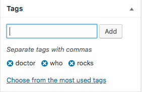

# WordPress Integration
Spot.IM provides a plugin for integrating with WordPress.

_Click here to watch a video walkthrough._

1. Log into your WordPress dashboard as an administrator.
2. In the left-hand navigation pane, click **Plugins** > **Add New**.
3. Enter "Spot.IM Comments" in the search field. You should see the [Spot.IM Comments](https://wordpress.org/plugins/spotim-comments/) plugin listed. If you do not see the plugin listed, you may be using an outdated or incompatible version of WordPress.
4. On the plugin page, click **Install Now** in the lower right-hand corner. This brings you to the installation page.
5. Click **Activate Plugin** to download and install the plugin.
6. Return to your WordPress dashboard and click **Settings** > **Spot.IM Settings** > **WP Sync**.
7. Enter your Spot ID in the Spot ID text box, then click **Save Changes**.

## Default behavior of SpotIM plugin

The plugin's default state is as follows:
1. SpotIM comments widget is loaded on the following types of pages in your WP site:
- Posts
- Pages
- Media
2. SpotIM's comments count is disabled.
3. Import of SpotIM's comments into WP comments system is disabled.
4. SpotIM's comments widget is palced right below the content.
5. SpotIM's popular in the community widget is enabled and will appear on your WP site once at least 10 articles have activity.
6. SEO and OG tags are disabled.

You may change each of the configurations above. Make sure to save changes on each page as you change it.

### Default Spot.IM Comments location
WP plugin injects the following elements in the location on the page where you want the widgets to appear. You can place these widgets anywhere, although we recommend placing them just below the page's main content.

If you prefer to independently implement SpotIM conversation, please refer to the [Social Kit documentation page](../social-kit/README.md) 

### Article Tags on WordPress
SpotIM calssifies each article to topics, according to data-article-tags. SpotIM's WP plugin pulls the topics from the standard WP tags box. 

This data enables you to enjoy SpotIM's advanced features: recirculation per topic and community pages.

## Configuring Spot.IM Comments location

In Advanced tab of the SpotIM plugin, you can see three options of positioning the comments:
- Replace WordPress Comments - Spot.IM comments will be located where the WP comments widget appeared before.
- After the content - Spot.IM comments will appear at the bottom of the page
- Let the theme decide - This allows to place the Spot.IM comments in a custom position. 
    When choosing this option, you need to inject 'SpotIM_Frontend::display_comments()' code in themes -> choose the theme ->     single.php

## Importing Spot.IM Comments Into WordPress

You can import your Spot.IM comments into WordPress. This allows you to view, moderate, and filter comments through the WordPress dashboard.

In order to use WordPress integration, you will need an _import token_. Contact [support@spot.im](mailto:support@spot.im) for help with getting an import token.

1. Log into your WordPress dashboard as an administrator.
2. In the left-hand navigation pane, click **Spot.IM**, then click **Display**.
3. Set all display options to _disabled_.
3. Click on the **WP Sync** tab.
4. Enter your **Import Token**. If you need an import token, contact [support@spot.im](mailto:support@spot.im).
5. Enter any additional configuration options including:
    - The number of posts to retrieve on sync
    - How often to import comments
6. Click **Import Now** to immediately import your comments, or click **Save Changes** to save.

The import process can take several minutes to complete. Once it's finished, all of your Spot.IM comments will be available in WordPress.
