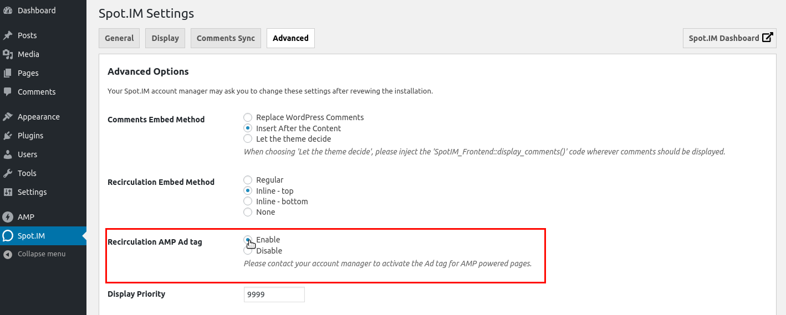

# Utilize AMP plugin
## Background:
Several of our partners use AMP to boost their traffic, we have a version of AMP conversation and we don't need to do any setup, It'll work out of the box using [AMP plugin](https://amp-wp.org/).


## Comments

Comments works on AMP powered pages using every embed methods.

| Comments Embed Method	     | Native Mode        | Transitive Mode    |
|----------------------------|--------------------|--------------------|
| Replace WordPress Comments | :white_check_mark: | :white_check_mark: |
| Insert After Content       | :white_check_mark: | :white_check_mark: |


### Manually add to a template:


When using official AMP plugin  and embed method set to `Let theme decide`, add the following code to desired template on `wp-content/themes/twentyseventeen/`, it must be inside the WordPress's  post loop.
```php
if ( method_exists( 'SpotIM_Frontend','display_amp_comments' ) ) {
    SpotIM_Frontend::display_comments();
}
```

## Recirculation

Recirculation works on AMP powered pages by default along with comments.

## Ads on AMP powered pages

To enable the Recirculation Ads for AMP powered pages, Go to Advance Tab on SpotIM Settings and set `Recirculation AMP Ad tag` to enable.



It will display the AMP Ads under the Recirculation.