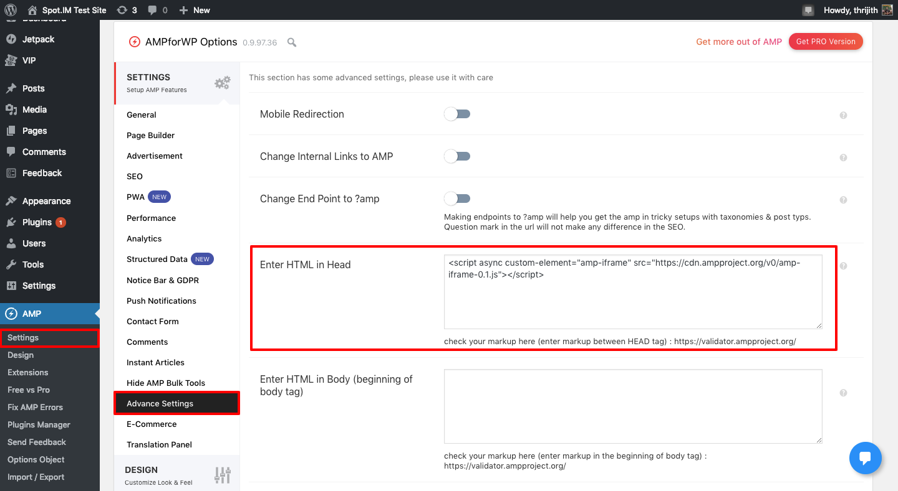
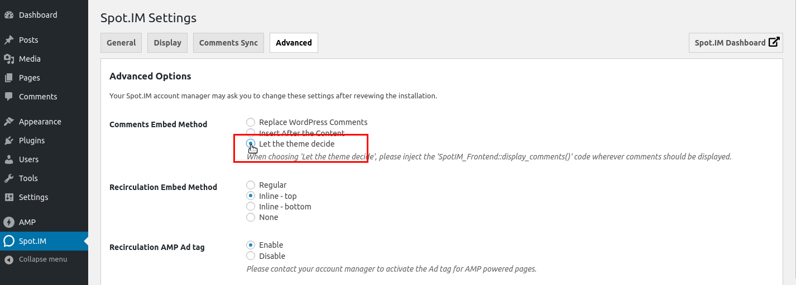
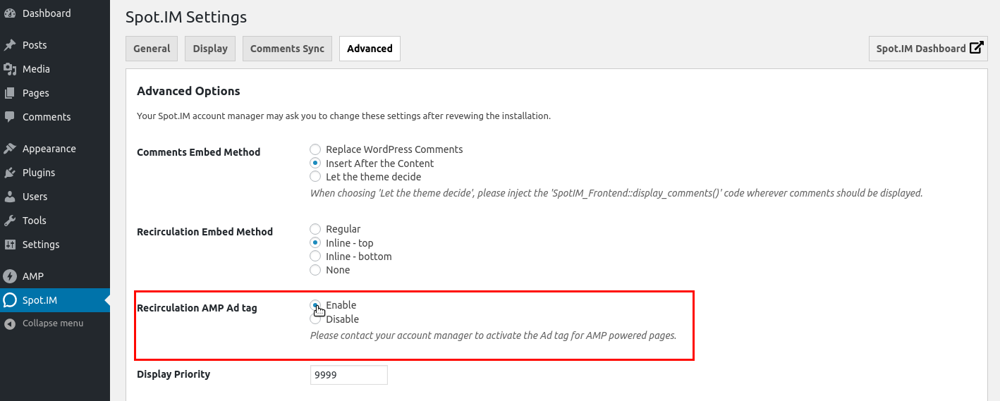

# Utilize AMP for WP plugin
## Background:
Several of our partners use AMP to boost their traffic, we have a version of AMP conversation but we need the partners to add the relevant parameters to load the correct conversation using the [AMP for WP] (https://ampforwp.com/)

## Important Note for Publishers That Already Have Spot.IM AMP Hardcoded onto Site
In order for AMP for WP plugin to work correctly, you must fully  delete all spot.im amp code that may have been hard coded onto your site. This includes code in both the head and body section. If you have any questions on exactly what to delete, please contact your account manager.


## Comments

If the `Comments Embed Method` is set to `Insert After the Content` it will work without any other setup.

Add the following code in the theme’s functions.php file, if the embed method is set to `Replace WordPress Comments`. It will append it to post content but not replace the WordPress Comments, you've to manually disable the WordPress comments.
```php
if ( method_exists( 'SpotIM_Frontend','display_amp_comments' ) ) {
    add_action( 'ampforwp_after_post_content', function() {
        SpotIM_Frontend::display_amp_comments();
    }, 10 );
}
```
Publisher can update the hook and use it where they can.

For embed methods `Comments Embed Method` and `Replace WordPress Comments` add below given script in the head to get it working.
```html
<script async custom-element="amp-iframe" src="https://cdn.ampproject.org/v0/amp-iframe-0.1.js"></script>
```
It is required as The tag 'amp-iframe' requires including the 'amp-iframe' extension JavaScript.

Add above script as shown and Save Changes. 

### Manually add to a template:


When using Official AMP plugin and embed method set to `Let theme decide`, use the following code to display the comments on AMP powered pages and it must be inside the WordPress's  post loop.
```php
if ( method_exists( 'SpotIM_Frontend','display_amp_comments' ) ) {
    SpotIM_Frontend::display_comments();
}
```


## Recirculation

Recirculations works on AMP powered pages using every embed methods.


| Recirculation Embed Method | Native Mode        | Transitive Mode    |
|----------------------------|--------------------|--------------------|
| Regular                    | :white_check_mark: | :white_check_mark: |
| Inline-top                 | :white_check_mark: | :white_check_mark: |
| Inline-bottom              | :white_check_mark: | :white_check_mark: |


### Ads on AMP powered pages

To enable the Recirculation Ads for AMP powered pages, Go to Advance Tab on SpotIM Settings and set `Recirculation AMP Ad tag` to enable.



It will display the AMP Ads under the Recirculation.
